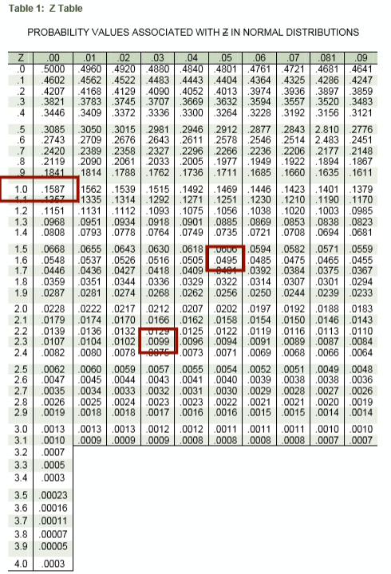

```{r setup, include=FALSE}
knitr::opts_chunk$set(echo = TRUE)
```

# 기술 통계

[★레퍼런스1 : 함수](https://data-analytics.tistory.com/10)

<br>

### 빈도 분포(Frequency Distribution)

```{r}
df <- read.csv2("dataset/guest_house.csv", header=T)

table(df)
```

<br>

```{r}
class(df$evlauation)
```

<br>

**범주화**

```{r}
df$label <- ordered(df$evlauation,
                  levels = c(1, 2, 3, 4, 5),
                  labels = c("poor", "below average", "average",
                             "above average", "excellent"))
# 빈도 확인 
data.frame(table(df$label))
```
<br>

**범위**

$$scope = \frac{max - min}{집단의 개수}$$

```{r}
scope <- ( max(df$evlauation) - min(df$evlauation)) / length(unique(df$label))
scope
```

<br>

```{r echo=FALSE}
barplot(table(df$label))
pie(table(df$label))
```

<br>
<br>

### 상대 빈도(Relative Frequency)

<br>

```{r}
#Relative frequency distribution table

prop.df <-prop.table(table(df$label))
data.frame(prop.table(table(df$label)))

# 백분율 빈도분포(percent frequency distribution)
data.frame(100*(prop.table(table(df$label))))
```

```{r echo=FALSE}
barplot(prop.df)
```
<br>
<br>

### 누적 빈도 분포 

<br>

```{r}
#Cumulative frequency distribution tables
cumsum(prop.table(table(df$label)))
```

<br>
<br>


### 현대차 예제

<br>


**범주화**

[레퍼런스](https://rfriend.tistory.com/38)

```{r}
# 현대차 예제 
costs <- c(91, 78, 93, 57, 75, 52, 99, 80, 97, 62,
          71, 69, 72, 89, 66, 75, 79, 75, 72, 76,
          104, 74, 62, 68, 97, 105, 77, 65, 80, 109,
          85, 97, 88, 68, 83, 68, 71, 69, 67, 74,
          62, 82, 98, 101, 79, 105, 79, 69, 62, 73)

df <- data.frame(costs)

# 범주화 
df$label <- cut(df$costs, breaks = c(0, 59, 69, 79, 89, 99, 109),
    labels = c('50~59', '60~69', '70~79', '80~89', '90~99', '100~109'))

df$label <- ordered(df$label)
df$label
```

<br>

```{r echo=FALSE}
barplot(table(df$label))
```


<br>
<br>


### 기술 통계량 : 평균, 중앙값, 최빈값

[레퍼런스](https://3months.tistory.com/97)

```{r}
getMode <- function(v) {
  uniqv <- unique(v)
  uniqv[which.max(tabulate(match(v, uniqv)))]
}

mean(df$costs)
median(df$costs)
getMode(df$costs)
```
<br>

**stem()으로 확인 가능**

<br>

```{r}
stem(df$costs)
```

<br>
<br>

### 분산도 : 범위, 변량, 표준편차 


```{r}
# 범위 
range(df$costs)

scope <- max(df$costs) - min(df$costs)
scope

# 변량 
var(df$costs)

# 표준편차
sd(df$costs)
```

<br>
<br>

### 사분위수 

사분위편차는 중앙값을 대푯값으로 선택했을 때 그에 대한 산포도로써 사용된다. 그러나 모수 추정이 어려워 널리 사용되지는 않는다. 

```{r}
# Calculating IQR
sort(df$costs)

summary(df$costs)

q <- quantile(df$costs)
q

q[4] - q[2]

# 사분위 범위
iqr <- IQR(df$costs)
iqr

1.5*iqr

3*iqr

# 사분위 편차 
iqr/2

```

**변동계수**

$$CV = \frac{S}{\bar{X}}$$

표본 표준편차/ 표본평균

변동계수 CV는 고유 단위에 의존하지 않기 때문에 두 그룹의 자료가 단위가 다르거나, 단위는 같지만 평균의 차이가 클 때 두 그룹의 자료에 대한 산포를 비교하는데 유용하다. 


```{r}
# 표본 변동계수
sample <- c(14, 21, 29, 33, 40, 45, 49, 50, 52, 67)

sd(sample)/mean(sample)
```

<br>
<br>

**상자 그림**

```{r echo=FALSE}
boxplot(df$costs)
```


<br>
<br>

### Plot의 종류 

1. 상자 그림 : 최댓값, 최솟값, 중앙값 및 사분위수 등으로 자료를 요약한 그림. 분포 형태 뿐 아니라 '이상치'(1.5IQR보다 더 벗어난 자료값) 파악에 유용하다.<br><br>
2. 산점도 : 순서쌍 (x,y)를 좌표평면에 나타낸 그림. 두 변 수 사이에 존재하는 연관성 파악하는 데 유용하다. 연관성이 어느 정도인지는 파악이 어려워 '상관계수'를 구해야 한다.<br><br>
3. 히스토그램 : 도수분포표를 구한 후, 각 계급구간에 대응하는 측정치들의 도수를 표현한다. 자료 분포를 파악하기 좋다.<br><br> 
4. 줄기와 잎 그림 : 자료 분포 형태를 파악하기 용이하다. 히스토그램과는 달리 자료값을 그대로 보여준다는 장점이 있다.<br><br>


**산점도**

```{r}
# scatter

height <- c(167, 165, 162, 167, 160, 163, 168, 
            175, 157, 170, 172, 164, 171, 174)

weight <- c(66, 65, 64, 68, 61, 59, 67, 
            70, 60, 65, 67, 64, 62, 63)

df <- data.frame(height, weight)

# 산점도 
scatter.smooth(df)

# 산점도 2
plot(weight, height, main = "Scatter Plot")

# 상관계수 
cor(weight, height)
```

<br>
<br>

# 추론 통계 

### Z-score 공식

Z-score는 표준화 점수이다. 표준화 점수는 정규 분포를 만든 후, 개별 데이터가 표준편차 상으로 어떤 위치에 존재하는지 보여주는 값이다. 

표준화 점수의 이점으로는 분포의 모양이나 **점수의 상대적 위치는 바뀌지 않고 평균과 표준편차만 바뀐다**. 따라서 **서로 다른 평균과 표준편차를 가진 검사점수를 비교하는데** 특히 유용하다.

<sub>
※ [R에서의 Z-score 함수](https://stats.stackexchange.com/questions/6943/zscore-function-in-r)
</sub>

<br>

```{r}
z.test()
```

<br>

**표본 각각의 경우 - 공식1**

$$z = \frac{x-μ}{σ}$$ 또는 $$z = \frac{x-\bar{X}}{S}$$

<br>
<br>

**표본이 여러개인 경우 - 공식2**

표본의 개수가 **충분히 많을 때**, 

1. 표본 평균의 분포는 정규분포를 따른다. <br><br>
2. 평균은 변하지 않지만, **분산은 표본 크기에 반비례**한다. 즉, 표본이 커질 수록 분산은 작아져 좁은 정규분포가 된다.<br><br>
3. **모집단의 분포가 비대칭이어도** 표본평균의 분포는 표본 크기가 커짐에 따라 정규분포에 가까워진다.<br><br> 

$$Z = \frac{\bar{X} - μ}{σ/\sqrt{n}}$$ 

<br>
<br>

### Z-score(Z 점수)를 계산하자. 

**예제1 : μ = 100, σ = 15라면, IQ가 85 이하일 확률은?**

공식1 사용 : $$z = \frac{x-μ}{σ}$$

z = (85-100)/15 = -1.0

z-score는 1.00 이므로 row는 1.0, column은 0.00이다. p-value(유의확률)는 0.1587이다. 

<br>
<br>

**예제2 : 상위 5%에 속하려면 IQ가 몇 점 이상이어야 할까?**

p가 0.05가 되는 z-score를 찾는다. z-score가 1.65일 때 p-value는 0.495로 가장 0.05에 가깝다. 따라서, $$ X = (1.65)*15 + 100 = 124.75 $$ (z-score\*모표준편차 + 모평균) 이다. 124.75여야 5% 이상에 속한다. 

<br>
<br>



<br>

z-score가 1.96일 때 정규분포의 양 p-value는 0.025로 합치면 0.05가 된다. 따라서, $$z = \bar{x} ± 1.96σ$$

<br>
<br>

### 가정 

- null 가설(귀무가설) 
- alternative (대립, 대안가설)

<br>
<br>

**z-critical, z-calculated**

개별 표본 평균 하나를 볼 때는 공식1 $z = \frac{x-μ}{σ}$을 사용했다. z-critical은 귀무가설이 기각되는 기각치에 해당하므로 하나의 개별 표본 평균의 수치에 해당한다. 따라서 공식1을 사용한다. 

반면, 표본 평균 전체 데이터의 z값을 계산하므로 여러 개의 데이터에 해당한다. 따라서 공식2 $Z = \frac{\bar{X} - μ}{σ/\sqrt{n}}$를 사용해 z-calculated를 구한다. 

z-calculated를 구했는데 z-critical을 넘어선 기각역에 해당한다면 귀무가설을 기각한다.

<br>
<br>

**type error**

- 1종 오류 : no effect, but you say "there is". 

귀무가설이 맞는데, 귀무가설을 기각하고 대립가설을 채택하는 경우이다. 

one-tail 검증의 경우 가설 검정력이 높아져서 1종 오류가 일어나기 쉽다. 한쪽에 있던 기각 영역이 다른 쪽에 합쳐지면서 기각 영역이 더 넓어지기 때문이다. 

- 2종 오류 : real effect, but you say "there's not" 

귀무가설이 틀렸는데, 귀무가설을 채택한 경우. 

<br>
<br>


